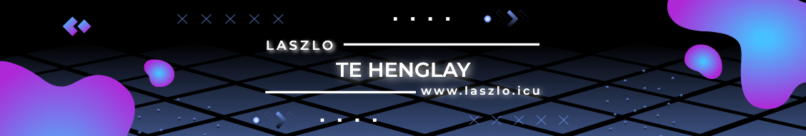

# 💫 About Me:
frontend developer and a student at the Royal University of Phnom Penh (RUPP), with a strong interest in creating visually appealing and user-friendly web applications.

# 💻 Tech Stack:
           
# 📊 GitHub Stats:
 
 

### ✍️ Random Dev Quote

---

<picture>
  <source media="(prefers-color-scheme: dark)" srcset="https://raw.githubusercontent.com/TeHenglay/TeHenglay/output/github-snake-dark.svg" />
  <source media="(prefers-color-scheme: light)" srcset="https://raw.githubusercontent.com/TeHenglay/TeHenglay/output/github-snake.svg" />
  
</picture>

<!-- Proudly created with GPRM ( https://gprm.itsvg.in ) -->
